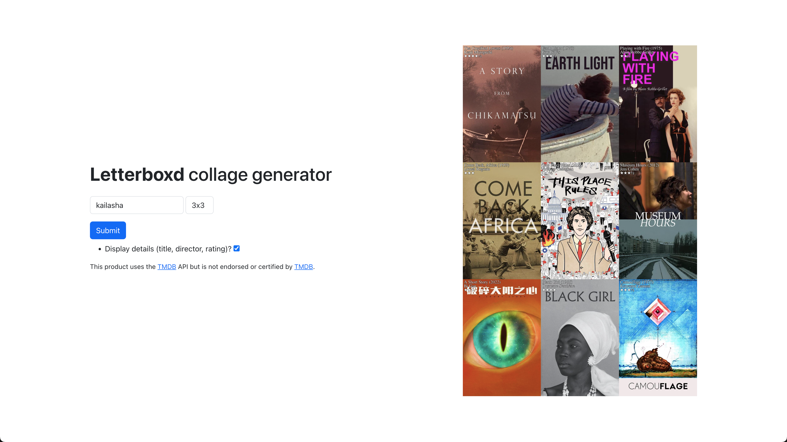

# Last Boxd (Frontend)

Frontend client for Last Boxd. Makes request to Go server: [last-boxd-server](https://github.com/sngbd/last-boxd-server)

## Features
- Generate a collage/chart based on submitted Letterboxd username
- Grid options up to 7x7
- Optional details on poster

## Specs
- Pure HTML, CSS, and JavaScript
- Request for image data using JavaScript Fetch API
- Basic styling with Bootstrap

## Example

